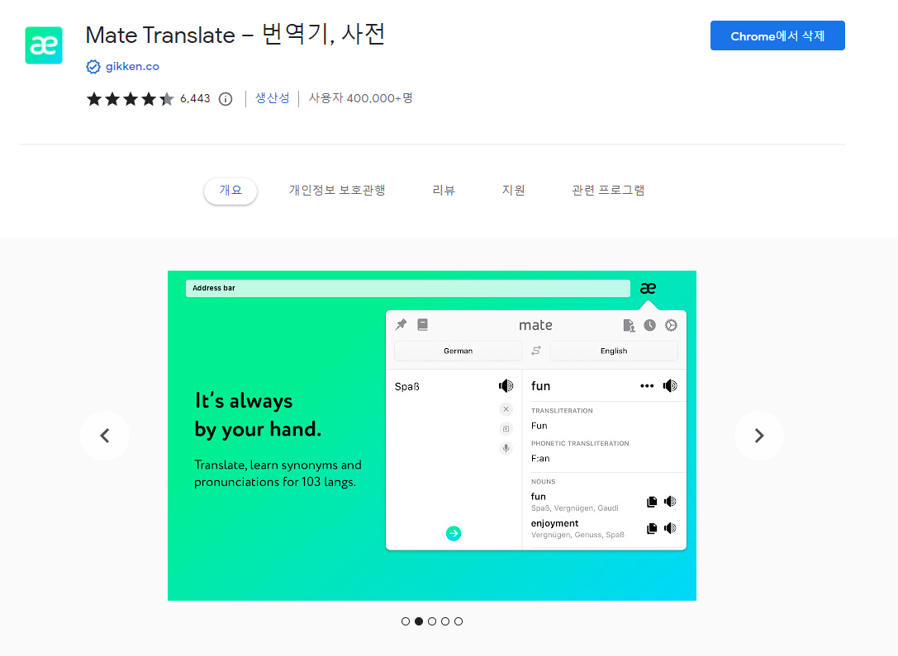
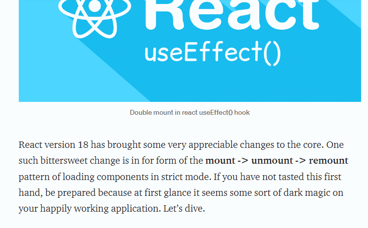
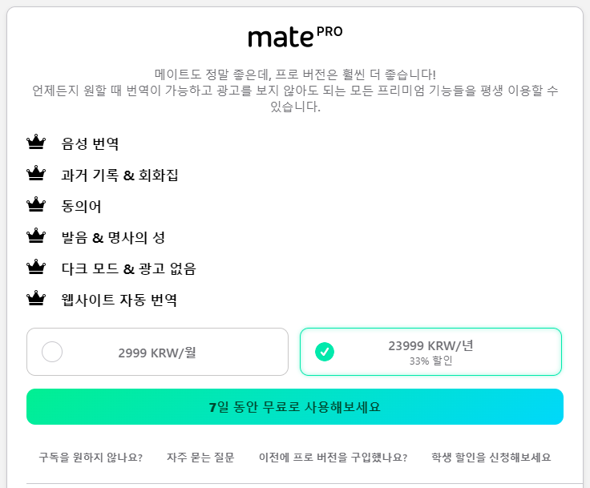
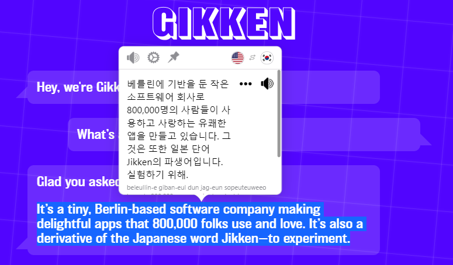

개발하면서 유용하게 사용하고 있는 크롬 익스텐션들을 소개해보고자 합니다.

## 1. Mate

번역을 손쉽게 해주는 익스텐션입니다. 단축키를 지정해놓고 번역할 문장을 드래그한 뒤 단축키를 누르면, 바로 번역 결과를 화면에 띄워줍니다.

내가 번역하고 싶은 문장만 빠르게 번역해서 결과를 알 수 있어서 굉장히 편리하게 쓰고 있습니다. 또한, 페이지 전체 번역 역시 가능합니다.

완전 무료는 아니고 한국 돈 월 3,000원에 다크 모드 등의 기능들을 제공하고 있습니다. 무료로도 아주 좋은 앱이라서 구독은 크게 할 필요는 없어 보입니다.

흥미롭게도 독일 베를린에 거점을 둔 회사에서 만들었군요. Gikken이라는 이름은 일본어로 '실험'을 뜻하는 Jikken에서 따왔다고 합니다.

## 2. Rested

## 3. Dark Reader

## 4. Octotree

## 5. Github1s

## 6. uBlacklist
