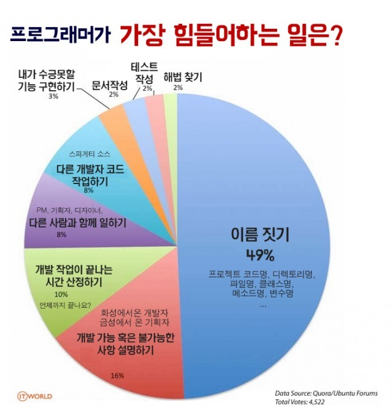

네이밍의 경우도 프로젝트 설계와 같이 **유지보수**와 **가독성**을 위해서 많은 고민을 했습니다. 네이밍을 어떻게 잘한다고 부를 수 있을까, 그런 생각을 해보았는데, **보자마자 '아, 이건 A다. 이건 B다.'** 라고 알 수 있다면 잘한 네이밍이 아닐까? 그런 생각을 해봤습니다.

## hooks

당연하겠지만 기존 hooks들과 마찬가지로 접두사 `use`를 붙이고, **camelCase**로 이름을 짓습니다.

## 상수

`services/data`에서 만드는 상수들은 모두 가독성을 위해 전부 **대문자와 snake_case**를 합성하여 네이밍을 합니다.

```typescript
// services/data/index.ts
export const IS_DEV = process.env.NODE_ENV === 'development';

export const IS_CLIENT = typeof window !== 'undefined';

export enum AUTH_TYPE {
  LOGIN = '로그인',
  SIGN_UP = '회원가입',
  FIND_PASSWORD = '비밀번호 찾기',
  RESIGN = '회원탈퇴'
}
...
```

## 타입 선언

### interface

```typescript
type TMaxWidth = 'max-w-xs' | 'max-w-sm'

interface IModal {
  isOpen: boolean
  onClose: () => void
  maxWidth: MaxWidth
}
```

기본적으로 객체에 대한 타입 선업은 `type`이 아닌 `interface`로 선언합니다. interface는 객체에만 할당할 수 있기 때문에, interface로 선언되었다면 바로 객체 타입임을 알 수 있기 때문입니다.

또한 interface임을 바로 알아볼 수 있게 접두사로 `I`를 붙여줍니다.

### type

객체가 아닌 나머지 타입 변수들은 모두 `type`으로 선언합니다.

type의 경우도 마찬가지로 앞에 `T`를 붙여서 선언합니다.

### namespace

```typescript
namespace NTable {
  interface User {
    id: string
    name: string
  }

  interface Post {
    id: string
    title: string
  }

  interface Comment {
    id: number
    content: string
  }
}
```

가독성을 위해 `namespace`를 사용하기도 합니다. namespace 역시 알아보기 쉽게 접두사로 `N`을 붙여서 선언합니다. 다만 하위 타입들에는 접두사를 붙이지 않습니다.

## 마치며

네이밍이라는 게 참 쉽지가 않은 것 같습니다. 오죽하면 프로그래머가 가장 힘든 일 절반이 네이밍이라는 설문조사가 있을 정도니까요.



그래도 약간의 센스가 필요한 작업이라서, 이름 짓는 법 하나 잘 정해놓으면 절반의 고충을 해결할 수 있다는 얘기일 테니까요.
