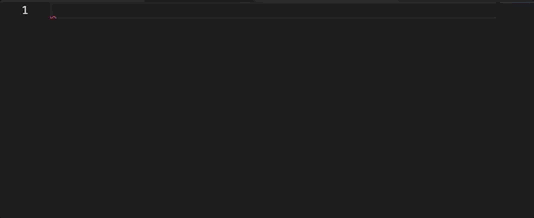

의외로 내용이 많기 때문에 따로 파트를 뺐습니다. 이 시리즈에서는 리액트 컴포넌트를 선언하고 사용할 때 어떠한 규칙을 사용하는 지 자세히 소개해보려고 합니다.

## 선언

모든 컴포넌트의 이름은 **PascalCase**로 작성합니다. (e.g. `Input`, `ButtonGroup`)

컴포넌트를 생성할 때는 만들어둔 코드 스니펫을 사용해서 만듭니다. 코드 스니펫에도 정해둔 네이밍 규칙이 있습니다.



[관련 코드 스니펫 링크](https://archive.kidow.me/docs/settings/Code%20Snippets)

```typescript
import type { FC } from 'react'

export interface Props {}
interface State {}

const Component: FC<Props> = () => {
  return <>Component</>
}

export default Component
```

### interface Props, State

Props와 State에 해당하는 타입을 이름그대로 지었습니다. Props를 export한 이유는, jest나 storybook 등을 사용할 때 Props가 필요하기 때문입니다.

### state

`useState` 등으로 선언하는 변수들은 타입에 따라, 용도에 따라 선언하는 기준을 다르게 두고 있습니다. 모든 변수는 **camelCase**로 선언합니다.

```typescript
interface State {
  isLoading: boolean
  password: string
  total: number
  isModalOpen: boolean
  postList: Post[]
}
```

`boolean` 타입의 변수들은 모두 접두사 `is`를 붙여서 boolean 값임을 명시합니다.

배열의 경우에는 접미사로 `List`를 붙여서 선언합니다.

또한, 객체 변수는 왠만하면 선언하지 않습니다. 객체는 단일 타입 변수로 바꿔 선언할 수도 있는 타입이고, 상태를 업데이트할 때 코드가 지저분해질 수도 있기 때문입니다.

## 네이밍 및 훅스와 변수 배치

다음 예시를 통해 설명해보겠습니다.

```typescript
import { useEffect, useMemo } from 'react'
import { useRouter } from 'next'
import { useObjectState, request } from 'services'

interface State {
  isLoading: boolean
  id: string
  password: string
}

const PostPage = () => {
  const [{ isLoading, id, password }, setState] = useObjectState<State>({
    isLoading: false,
    id: '',
    password: ''
  })
  const { query } = useRouter()
  const [user] = useUser()

  const get = async () => {
    try {
      await request.get('/posts')
    } catch (err) {
      console.log(err)
    }
  }

  const create = async () => {
    try {
      await request.post('/posts', {})
    } catch (err) {
      console.log(err)
    }
  }

  const isLoggedIn: boolean = useMemo(() => !!user?.id, [user])

  useEffect(() => {
    get()
  }, [])
  useEffect(() => {
    ...
  }, [user])
  return ...
}

export default Page
```

여기서 다음과 같은 규칙들을 정해둡니다.

### 1. `useObjectState`는 항상 최상위에

[useObjectState](https://archive.kidow.me/docs/hooks/useObjectState)는 제가 직접 만든 hooks로, useState의 인자를 객체로 선언함으로써 모든 state를 한 hooks로 관리할 수 있습니다. state가 컴포넌트에서 가장 핵심인 요소라고 생각해서 최상위에 두었습니다. 만약 state의 초깃값으로 받아와야 할 값이 있다면 예외로 useObjectState보다 위에 선언해줍니다.

### 2. 나머지 hooks들은 useObjectState 바로 아래

useObjectState 이 외에 나머지 hooks들은 전부 useObjectState 아래에 별다른 순서 없이 나열해서 사용합니다.

### 3. `useEffect`는 항상 return문 위에

return문은 항상 최하단이고, 모든 useEffect는 return문 바로 위에 몰아넣습니다.

### 4. `useMemo`는 useEffect 위에

useMemo는 함수와 useEffect 사이에 모두 넣습니다.

### 5. 함수 네이밍

#### get, create, update, remove

api로 요청하는 함수의 경우는 CRUD에 맞게 접두사로 `create`, `get`, `update`, `remove`를 붙여서 이름을 지어줍니다. 만약 각각의 요청하는 함수가 하나만 있다면, 접두사 없이 한 단어로만 짓습니다. 이렇게 하는 이유는, 이 함수가 하나만 있다는 것을 명시하기 위함입니다.

그 외 나머지 함수들은 모두 접두사 `on`을 붙여서 이름을 짓습니다.
