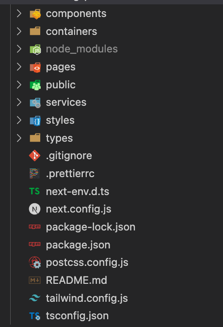
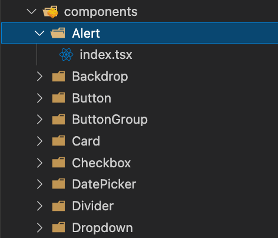
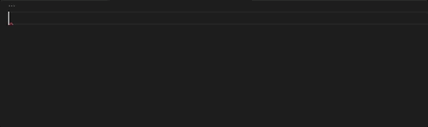
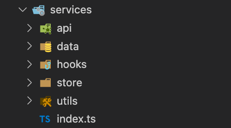

<!-- toc -->

> Next.js 12.1.0 버전 기준으로 작성된 글입니다. Typescript와 TailwindCSS를 사용했습니다.

먼저 대략적으로 아래와 같은 구조를 사용하고 있습니다.



components, pages, public, styles는 원래 Next.js에 있는 폴더지만 containers, services, types는 새로 만든 폴더입니다.

## components, 그리고 containers

components는 말 그대로 구성요소 모음으로, 공용으로 쓰이는 가장 작은 단위에 속하는 것들만을 모아 놓은 폴더입니다.

여러 번 사용될 수 있는 `Input`, `Button` 같은 것들이 대표적인 컴포넌트입니다.

컴포넌트의 이름은 파스칼-케이스로 작성하고, 한 컴포넌트의 여러 파일이 있을 수 있기 때문에 폴더로 생성합니다.



### index.tsx

상대 경로를 지정하고 import문을 깔끔하게 쓰기 위해서 `components/index.tsx` 파일을 생성합니다. (다른 폴더들도 마찬가지로 index 파일을 생성합니다.)

`index.tsx` 파일에서 모든 컴포넌트들을 내보냅니다. (다른 폴더도 마찬가지입니다.)

```typescript
// components/index.tsx
export { default as Alert } from './Alert'
export { default as Backdrop } from './Backdrop'
export { default as Button } from './Button'
export { default as ButtonGroup } from './ButtonGroup'
export { default as Card } from './Card'
```

여기서 코드 스니펫을 만들어 놓으면 빠르게 export문을 짤 수 있습니다.



### containers

components도 있지만 containers도 있는데, containers는 하나의 작은 단위로는 보기 어렵지만 구성요소임에는 분명한 컴포넌트들의 모음입니다. Atomic React로 치자면 organisms와 templates에 속하는 컴포넌트들을 포함합니다. `Modal`, `Header`, `Footer` 등이 대표적인 containers에 속하는 컴포넌트입니다.

## services

services는 컴포넌트에 해당하는 것들을 제외한 모든 기능들을 담은 폴더로 활용하고 있습니다. 주로 `api`, `hooks`, `store`, `utils`, `data` 등이 있으며, 어떤 라이브러리를 쓰느냐에 따라 더 추가해서 쓰기도 합니다.



### api

api 관련 코드들만 모아 놓고 쓰는 폴더입니다. 주로 사용하는 **axios** 에 대한 코드는 이렇습니다.

```typescript
// services/api/index.ts
import axios from 'axios'
import type { AxiosError } from 'axios';

const IS_DEV = process.env.NODE_ENV === 'development'

const request = axios.create({
  baseURL: 'baseURL',
  timeout: 15000,
  headers: {
    'Content-Type': 'application/json'
  }
})

request.interceptors.request.use((config) => {
  if (IS_DEV) {
    console.log(
      '%c%s',
      'color: #d9480f; font-weight: bold',
      `${config.method?.toUpperCase()} ${config.url}`
    )
    if (config.params) {
      console.log('%c%s', 'color: #d9480f', 'req.query:')
      console.table(config.params)
    }
    if (config.data) {
      console.log('%c%s', 'color: #d9480f', 'req.body:')
      console.table(config.data)
    }
  }
  return config
})

request.interceptors.response.use(
  ({ data, config }) => {
    if (IS_DEV) {
      console.log(
        '%c%s', 
        'color: #d9480f',
        `${config.method?.toUpperCase()} ${config.url} | data:`
      )
      if (Array.isArray(data)) console.log(data)
      else console.table(data)
    }
    return data
  }
)

export default request
```

`create` 메소드를 통해 axios instance를 만들어 줍니다. 
