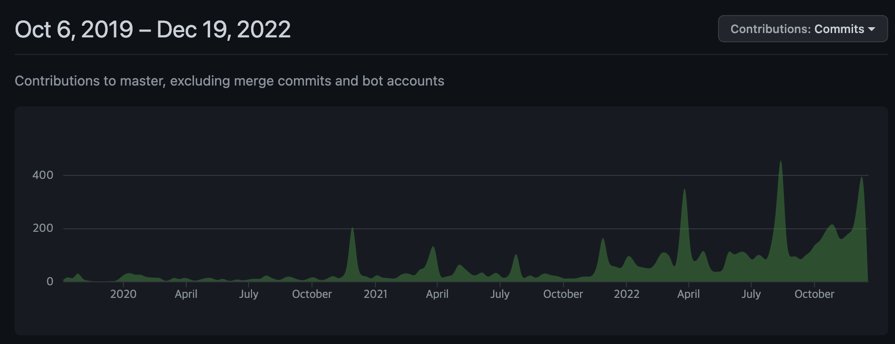
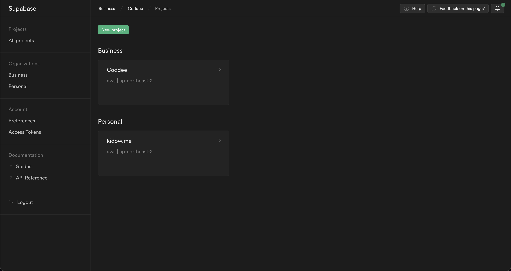
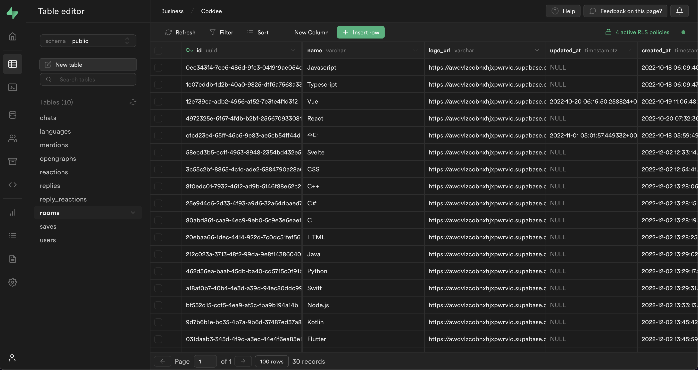
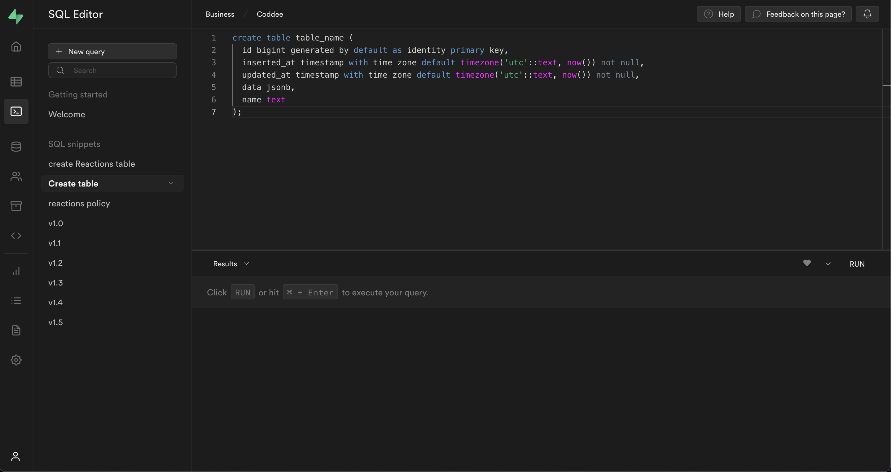
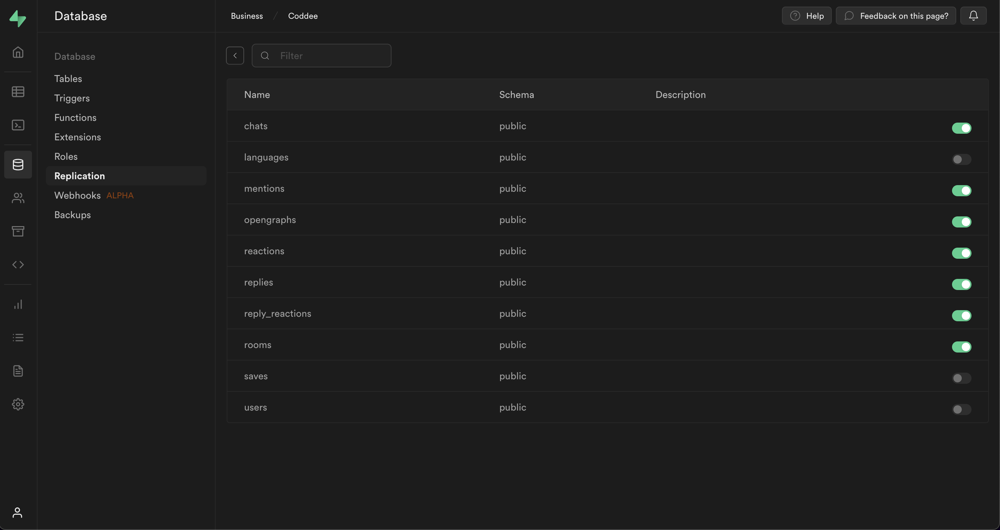

개발자 채팅방 Coddee의 인프라 설계 과정을 궁금해 하실 분들을 위해 이 글을 남겨봅니다.

Coddee의 경우도 그렇지만, 저는 사이드 프로젝트를 할 때 새로 매력적인 제품이 등장하지 않는 이상 항상 사용하는 기술과 플랫폼들이 있습니다. Frontend framework는 **Next.js**, CSS framework는 **TailwindCSS**, 클라우드 컴퓨팅 관련 플랫폼은 **Vercel**, 그리고 백엔드는 직접 구축하지 않고 오늘 다룰 주제인 **Supabase**를 사용합니다.

## Supabase란


Supabase는 Baas(Baekend as a service) 중 하나로, 구글의 유명한 Firebase에서 영감을 받아 대체제로서 역할을 하고자 시작된 오픈소스 프로젝트입니다.



Firebase와 가장 두드러지는 차이점은 Firebase의 Database는 noSQL을 채택하지만 Supabase는 위의 홈 화면에서도 강조하듯이 Postgre를 전면에 내세운 관계형 데이터베이스를 사용한다는 점입니다.

### 과거의 문제점

2년 전 Coddee의 전신인 ddtalk이라는 서비스를 만들 당시에는 Firebase를 사용해서 백엔드를 구축했었습니다. 그 때 noSQL을 이리저리 지지고 볶아봤지만 결론적으로 noSQL에 대한 기억은 좋지 못했습니다. 그 이유는 관계형과 달리 테이블 간 관계를 정의하지 않다 보니 유지보수를 하는 것에 너무 피로감을 느끼게 된 것이었습니다. 그래서 그 프로젝트를 그만 두고 말았죠.

제가 기억하는 2년 전의 Supabase는 Realtime 기능도 없었고, Firebase가 가지고 있는 기능인 Storage와 Serverless Function도 지원하지 않아 아직 사이드 프로젝트로 사용하기도 많은 한계가 있었습니다.

### 왜 Supabase였나


Firebase는 뒤에 구글이 버티고 있을만큼 든든한 플랫폼이었지만 noSQL을 사용하는 점 때문에 저는 대체제를 찾을 수 밖에 없었습니다. Supabase는 그 문제점을 해결해 줄 수단이었으며, 오픈소스임에도 불구하고 작년 8월에 시리즈 A, 올해 8월에 시리즈 B 단계까지 투자 유치를 하는 등 엄청난 성장세를 보이고 있습니다. 개인적으로 UI/UX도 Firebase에 비교하자면 더욱 낫다고 생각하는 바입니다.

## 구축 과정

### 대시보드 홈

Supabase는 무료 요금제를 제공하는 데, 2개의 프로젝트까지 무료로 만들 수 있습니다. 저는 2개의 프로젝트를 각각 개발용과 배포용으로 하나씩 만들었습니다.



Business와 Personal은 단순 Organization 이름이니 신경 안쓰셔도 됩니다. Coddee는 배포용으로 말 그대로 실제 서비스인 Coddee와 관련된 프로젝트이고, kidow.me의 경우는 개발용이면서 제 개인 프로젝트나 테스트 용으로 자유롭게 사용하는 프로젝트입니다.

### 프로젝트 홈


Coddee 프로젝트 홈 화면입니다. 이제는 월 호출 수가 천 단위에서 놀고 있네요. Coddee에서 사용하는 핵심 기술이 바로 위에 4가지 기술입니다.

### 데이터베이스 테이블

현재 DB의 테이블 구조는 다음과 같이 10개로 짜놓았습니다.



- chats: 채팅 데이터를 담는 테이블
- languages: 코드에디터 작성 시 적용할 언어들
- mentions: 멘션과 관련된 테이블
- opengraphs: 채팅에서 외부 링크가 있을 때 링크에 대한 오픈그래프 정보를 담는 테이블
- reactions: 채팅에 대한 이모지 리액션에 관한 정보를 담는 테이블
- replies: 채팅에 대한 답변(쓰레드)에 대한 데이터를 담는 테이블
- reply_reactions: 채팅 답변에 관한 데이터를 담는 테이블
- rooms: 채팅방 목록에 대한 정보를 담는 테이블
- saves: 채팅 저장에 대한 정보를 담는 테이블
- users: 유저 정보를 담는 테이블

Supabase는 이러한 테이블들을 GUI로 간편하게 짤 수 있도록 편의를 제공해주기도 하지만, 다른 방식으로 **SQL Editor**라는 기능을 제공하기도 합니다. PostgreSQL에 대한 기본 지식이 있다면 직접 SQL을 짜서 테이블 구성을 할 수 있도록 하는 방법인데요, 저는 한 번 짤 때 세세하게 짜고 싶어서 SQL Editor를 이용해서 짰습니다.



> 여담이지만 Supabase가 사용하는 에디터 라이브러리와 Coddee에서 쓰는 라이브러리가 같습니다.
>
> [Monaco Editor](https://microsoft.github.io/monaco-editor/)

각 테이블들을 어떤 식으로 SQL을 짜서 만들었는지 공유해 봅니다.

#### users

```sql
create extension
  if not exists moddatetime schema extensions;

-- 유저 테이블 생성
create table
  users (
    id uuid references auth.users on delete cascade not null primary key,
    email varchar unique not null,
    nickname varchar unique not null,
    avatar_url varchar,
    intro varchar,
    github_url varchar,
    blog_url varchar,
    job_category varchar,
    created_at timestamp
    with
      time zone default timezone('utc' :: text, now()) not null,
      updated_at timestamp
    with
      time zone
  );

-- 수정된 시각 추적
create trigger
  users_updated_at before
update
  on users for each row
execute
  procedure moddatetime(updated_at);

-- Row Level Security
alter table
  users enable row level security;

create policy
  "가입해야만 가능" on public.users for
insert
with
  check (auth.role() = 'authenticated');

create policy
  "아무나 조회 가능" on public.users for
select
  using (true);

create policy
  "내 계정만 수정 가능" on public.users for
update
  using (auth.uid() = id);

create policy
  "내 계정만 삭제 가능" on public.users for
delete
  using (auth.uid() = id);
```

첫 줄에 `moddatetime`는 소개를 위해 넣었습니다. 저도 Supabase를 도입하면서 처음 Postgres를 알게 되었는데, Postgres는 신기하게도 Extension이라는 개념이 있고, Extension을 통해 별의별 백엔드 기술을 연동해서 그 생태계 안에서 거의 모든 걸 다 처리할 수가 있습니다. 예를 들면 `pg_cron`은 일정 시간마다 특정 작업을 수행하게 하는 스케쥴러를 만들게 해주고, `moddatetime`은 데이터가 수정될 때마다 지정해 둔 칼럼에 수정된 시각을 자동으로 넣어 줍니다. ([참조 링크](https://www.amazingcto.com/postgres-for-everything/))

## Row Level Security

그리고, 보안적으로 놓치면 안되는 아주 중요한 기능이 있습니다. 바로 RLS(Row Level Security)인데요, 데이터에 대한 CRUD를 함부로 할 수 없도록 제약 조건을 걸게 하는 정책이라고 보시면 됩니다.

저처럼 서버 없이 클라이언트로만 구축을 하는 경우에는 네트워크에 API 호출에 대한 요청과 응답 내용이 전부 노출되기 떄문에, 누군가가 임의로 남의 데이터를 손상시킬 수도 있습니다. 따라서, 자체 서버를 구축했으면 모르겠지만 Coddee같은 케이스는 반드시 보안 정책을 설정해 놓아야 합니다.

#### users의 RLS

insert의 경우, auth라는 객체가 Postgres에 내부적으로 존재하며 `auth.role() = 'authenticated'`는 가입 후 인증이 된 상태를 말하는 데, Supabase Auth를 통해 인증이 된 상태여야만 users 테이블에 한 줄이 생성된다는 의미입니다.

select의 경우 true인데, 아무나 조회 가능하기 때문에 true로 넘겨주었습니다. 굳이 할 필요없지만 명시하기 위해 지정해 놓는 것이 좋다고 생각했습니다.

update와 delete의 경우 나만이 내 정보를 수정하고 탈퇴할 수 있게 해야 하기 때문에 `auth.uid() = id`라는 조건을 걸어두었습니다.

#### rooms

```sql
-- 채팅방 테이블 생성
create table
  rooms (
    id uuid default uuid_generate_v4() not null primary key,
    name varchar not null,
    logo_url varchar not null,
    created_at timestamp
    with
      time zone default timezone('utc' :: text, now()) not null,
      updated_at timestamp
    with
      time zone
  );

create trigger
  rooms_updated_at before
update
  on rooms for each row
execute
  procedure moddatetime(updated_at);

alter table
  rooms enable row level security;

create policy
  "관리자인 나만 생성 가능" on public.rooms for
insert
with
  check (auth.email() = 'wcgo2ling@gmail.com');

create policy
  "조회는 아무나 가능" on public.rooms for
select
  using (true);

create policy
  "관리자인 나만 수정 가능" on public.rooms for
update
  using (auth.email() = 'wcgo2ling@gmail.com');

create policy
  "관리자인 나만 삭제 가능" on public.rooms for
delete
  using (auth.email() = 'wcgo2ling@gmail.com');
```

rooms의 RLS는, 조회는 누구나 가능하지만 생성과 수정, 삭제는 관리자인 저만 가능하게 하도록 해야 하기 때문에 제약 조건에 이메일을 그냥 집어넣었습니다.

#### chats

```sql
-- 채팅 테이블 생성
create table
  chats (
    id bigint generated by default as identity primary key not null,
    user_id uuid references public.users on delete cascade not null,
    room_id uuid references public.rooms on delete cascade not null,
    content text not null,
    code_block text,
    language varchar,
    created_at timestamp
    with
      time zone default timezone('utc' :: text, now()) not null,
      updated_at timestamp
    with
      time zone,
      deleted_at timestamp
    with
      time zone
  );

create trigger
  chats_updated_at before
update
  on chats for each row
execute
  procedure moddatetime(updated_at);

alter table
  chats enable row level security;

create policy
  "가입해야만 채팅 가능" on public.chats for
insert
with
  check (auth.role() = 'authenticated');

create policy
  "모두가 조회 가능" on public.chats for
select
  using (true);

create policy
  "내 채팅만 수정 가능" on public.chats for
update
  using (auth.uid() = user_id);

create policy
  "내 채팅만 삭제 가능" on public.chats for
delete
  using (auth.uid() = user_id);

begin
;

drop publication
  if exists supabase_realtime;

create publication
  supabase_realtime;

commit
;

alter publication
  supabase_realtime
add
  table chats;

alter table
  chats replica identity full;
```

Supabase는 Realtime 기능을 기본적으로 제공하는 데, 이 기능의 기본적으로 비활성화되어 있어 수동으로 켜주어야 합니다. 게다가 테이블 기준으로 활성화 여부를 결정할 수 있기 때문에 이 활성화를 해주지 않으면 리얼타임 기능이 동작하질 않습니다.

마지막 `replica identity full`은 저도 잘은 모르는 데, 문서에 따르면 insert뿐만 아니라 update와 delete도 리얼타임으로 하고 싶으면 꼭 이 선언을 해야 한다고 하네요.



#### reactions

```sql
create table reactions (
  id bigint generated by default as identity primary key not null,
  user_id uuid references public.users on delete cascade not null,
  chat_id bigint references public.chats on delete cascade not null,
  room_id uuid references public.rooms on delete cascade not null,
  text varchar not null,
  created_at timestamp
    with
      time zone default timezone('utc' :: text, now()) not null
);

alter publication
  supabase_realtime
add
  table reactions;

alter table
  reactions replica identity full;

alter table
  reactions enable row level security;

create policy
  "가입해야만 리액션 가능" on public.reactions for
insert
with
  check (auth.role() = 'authenticated');

create policy
  "모두가 조회 가능" on public.reactions for
select
  using (true);

create policy
  "내 리액션만 수정 가능" on public.reactions for
update
  using (auth.uid() = user_id);

create policy
  "내 리액션만 삭제 가능" on public.reactions for
delete
  using (auth.uid() = user_id);
```

#### languages

```sql
-- 언어 테이블 생성
create table
  languages (
    id bigint generated by default as identity primary key not null,
    label varchar not null,
    value varchar not null,
    template text,
    created_at timestamp
    with
      time zone default timezone('utc' :: text, now()) not null
  );

alter table
  languages enable row level security;

create policy
  "관리자만 추가 가능" on public.languages for
insert
with
  check (auth.email() = 'wcgo2ling@gmail.com');

create policy
  "누구나 조회 가능" on public.languages for
select
  using (true);

create policy
  "관리자만 수정 가능" on public.languages for
update
  using (auth.email() = 'wcgo2ling@gmail.com');

create policy
  "관리자만 삭제 가능" on public.languages for
delete
  using (auth.email() = 'wcgo2ling@gmail.com');
```

#### replies

```sql
-- 채팅 답장 테이블
create table
  replies (
    id bigint generated by default as identity primary key not null,
    user_id uuid references public.users on delete cascade not null,
    chat_id bigint references public.chats on delete cascade not null,
    content text not null,
    code_block text,
    language varchar,
    created_at timestamp
    with
      time zone default timezone('utc' :: text, now()) not null,
      updated_at timestamp
    with
      time zone
  );

create trigger
  replies_updated_at before
update
  on replies for each row
execute
  procedure moddatetime(updated_at);

alter publication
  supabase_realtime
add
  table replies;

alter table
  replies replica identity full;

alter table
  replies enable row level security;

create policy
  "가입해야만 답장 가능" on public.replies for
insert
with
  check (auth.role() = 'authenticated');

create policy
  "모두가 조회 가능" on public.replies for
select
  using (true);

create policy
  "내 답장만 수정 가능" on public.replies for
update
  using (auth.uid() = user_id);

create policy
  "내 답장만 삭제 가능" on public.replies for
delete
  using (auth.uid() = user_id);
```

#### reply_reactions

```sql
-- 채팅 답변 리액션 테이블
create table reply_reactions (
  id bigint generated by default as identity primary key not null,
  user_id uuid references public.users on delete cascade not null,
  chat_id bigint references public.chats on delete cascade not null,
  reply_id bigint references public.replies on delete cascade not null,
  text varchar not null,
  created_at timestamp
    with
      time zone default timezone('utc' :: text, now()) not null
);

alter publication
  supabase_realtime
add
  table reply_reactions;

alter table
  reply_reactions replica identity full;

alter table
  reply_reactions enable row level security;

create policy
  "가입해야만 리액션 가능" on public.reply_reactions for
insert
with
  check (auth.role() = 'authenticated');

create policy
  "모두가 조회 가능" on public.reply_reactions for
select
  using (true);

create policy
  "내 리액션만 수정 가능" on public.reply_reactions for
update
  using (auth.uid() = user_id);

create policy
  "내 리액션만 삭제 가능" on public.reply_reactions for
delete
  using (auth.uid() = user_id);
```

#### mentions

```sql
create table
  mentions (
    id bigint generated by default as identity primary key not null,
    mention_to uuid references public.users on delete cascade not null,
    mention_from uuid references public.users on delete cascade not null,
    chat_id bigint references public.chats on delete cascade not null,
    reply_id bigint references public.replies on delete cascade,
    created_at timestamp
    with
      time zone default timezone('utc' :: text, now()) not null
  );

alter publication
  supabase_realtime
add
  table mentions;

alter table
  mentions enable row level security;

create policy
  "로그인해야만 맨션 가능" on public.mentions for
insert
with
  check (auth.role() = 'authenticated');

create policy
  "모두가 조회 가능" on public.mentions for
select
  using (true);

create policy
  "맨션은 수정 불가능" on public.mentions for
update
  using (false);

create policy
  "맨션은 삭제 불가능" on public.mentions for
delete
  using (false);
```

#### opengraphs

```sql
create table
  opengraphs (
    id bigint generated by default as identity primary key not null,
    chat_id bigint references public.chats on delete cascade,
    reply_id bigint references public.replies on delete cascade,
    room_id uuid references public.rooms on delete cascade not null,
    title varchar,
    description varchar,
    image varchar,
    url varchar,
    site_name varchar,
    created_at timestamp
    with
      time zone default timezone('utc' :: text, now()) not null
  );

alter publication
  supabase_realtime
add
  table opengraphs;

alter table
  opengraphs enable row level security;

create policy
  "누구나 생성 가능" on public.opengraphs for
insert
with
  check (true);

create policy
  "모두가 조회 가능" on public.opengraphs for
select
  using (true);

create policy
  "수정 불가능" on public.opengraphs for
update
  using (false);

create policy
  "삭제 불가능" on public.opengraphs for
delete
  using (false);
```

#### saves

```sql
create table
  saves (
    id bigint generated by default as identity primary key not null,
    user_id uuid references public.users on delete cascade not null,
    chat_id bigint references public.chats on delete cascade,
    reply_id bigint references public.replies on delete cascade,
    created_at timestamp
    with
      time zone default timezone('utc' :: text, now()) not null
  );

alter table
  saves enable row level security;

create policy
  "가입해야만 저장 가능" on public.saves for
insert
with
  check (auth.role() = 'authenticated');

create policy
  "내 저장만 조회 가능" on public.saves for
select
  using (auth.uid() = user_id);

create policy
  "내 저장만 수정 가능" on public.saves for
update
  using (auth.uid() = user_id);

create policy
  "내 저장만 삭제 가능" on public.saves for
delete
  using (auth.uid() = user_id);
```

## 정리

Supabase 구축에 대한 내용은 여기까지입니다. Authentication과 Storage도 있는데 별로 중요한 내용이 없어서 생략하겠습니다.

과거 전신인 ddtalk도 그렇지만 Coddee를 만들게 된 가장 큰 이유는, **혼자서도 만들 수 있을 것 같다는 생각** 때문이었습니다. 서버 구축 없이도 Supabase를 통해 채팅방 플랫폼을 만드는 것이 가능할 것 같아서 한 번 만들어보자 했던게 이 프로젝트의 시작이었습니다. 이렇게 기술이 좋고 편해진 만큼 여러분들도 소소한 아이디어가 있다면 Supabase와 같은 편리한 도구들을 잘 찾아서 만든다면, 언젠가는 OpenAI같은 엄청난 서비스를 혼자서 만들게 될 날도 오게 되지 않을까요?
