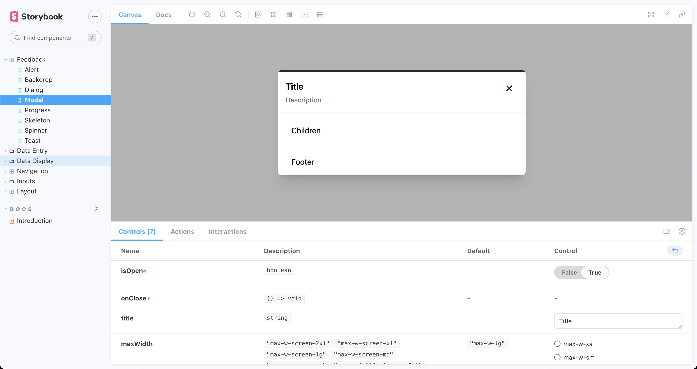
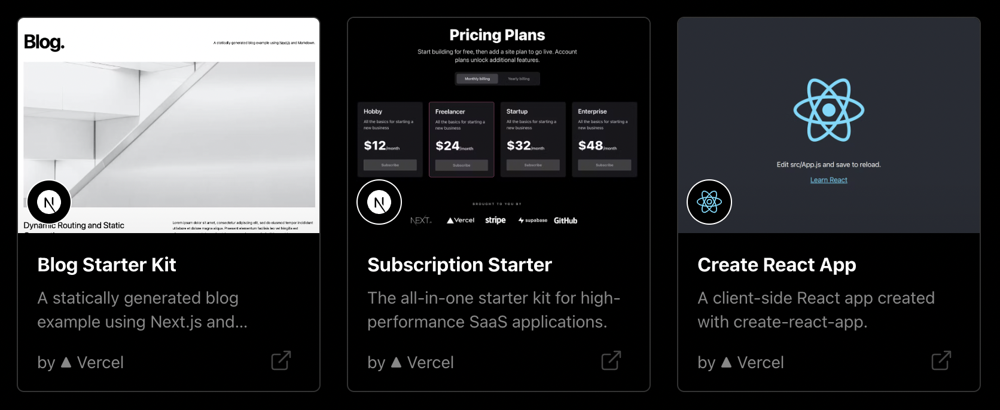
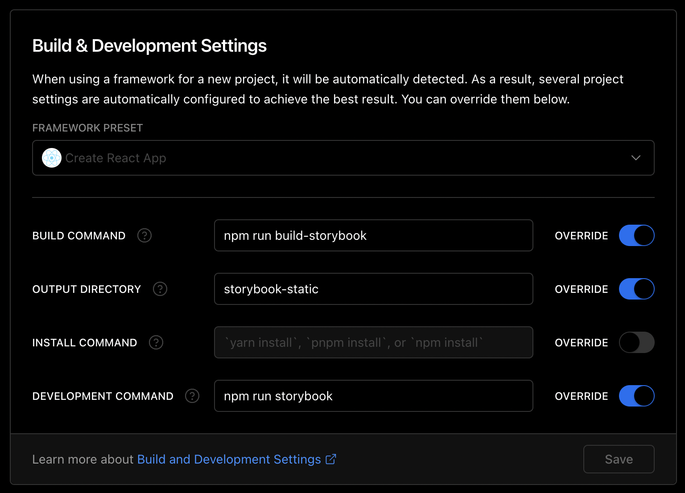
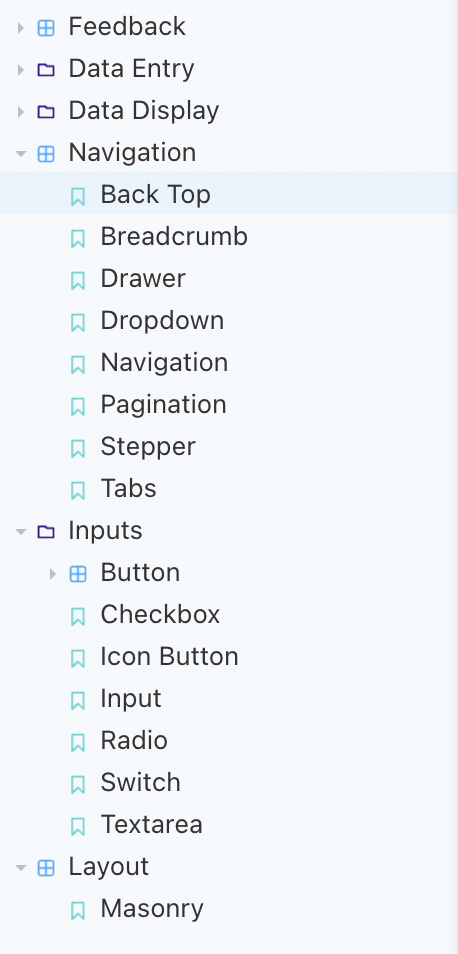

## 개요



직접 만든 컴포넌트 코드들을 [코드 보관소](https://archive.kidow.me)에 적어 놓고는 있지만, 코드만 보고는 이 컴포넌트가 정확히 어떻게 생겼는지는 알 수가 없죠. 개발 문서 작성은 Docusaurus를 통해 하고 있지만 실제로 보여줄 수 있는 컴포넌트 보관소는 **Storybook**을 사용하면 아주 제격일 것 같아서 이걸로 한 번 만들어보고자 했습니다.

## 만드는 과정

저는 **Vercel**을 주로, 아니 거의 항상 사용하는 편이라서 Vercel을 통해서 프로젝트를 생성해줍니다. Vercel 대시보드에 들어가서 `New Project`를 클릭해 줍니다.

이 때, Vercel에서 템플릿으로 생성 시 Storybook에 대한 템플릿은 따로 없기 때문에 **Create React App**으로 일단 생성해 주어야 합니다. CRA로 만든 앱에 스토리북을 깔고, 스토리북으로 배포할 수 있도록 커맨드를 변경하면 됩니다.



프로젝트를 생성 후 `Settings > General` 탭에 가보면 `Build & Development Setting` 가 있는데, 여기서 커맨드를 다음과 같이 덮어씌워줍시다.



이제는 프로젝트에서 스토리북을 깔아줍시다.

```bash
npm install --save-dev @storybook/react @storybook/preset-create-react-app @storybook/builder-webpack5 @storybook/manager-webpack5 @storybook/node-logger
```

그리고 `package.json`에서 스크립트를 추가해줍니다.

```json{7-8} title="package.json"
{
  "scripts": {
    "start": "react-scripts start",
    "build": "react-scripts build",
    "test": "react-scripts test",
    "eject": "react-scripts eject",
    "storybook": "start-storybook -p 6006 -s public",
    "build-storybook": "build-storybook -s public"
  }
}
```

`.storybook/main.js` 파일을 만들고 다음과 같이 작성해 줍니다.

```js
/** @type {import('@storybook/core-common').StorybookConfig} */
module.exports = {
  stories: ['../src/**/*.stories.mdx', '../src/**/*.stories.@(js|jsx|ts|tsx)'],
  addons: ['@storybook/preset-create-react-app'],
  framework: '@storybook/react',
  core: {
    builder: '@storybook/builder-webpack5'
  }
}
```

커밋 후 배포하면, 리액트가 아닌 스토리북이 실행된 채로 Vercel에 프로젝트가 올라갑니다.

## 컴포넌트 분류하기



직접 만든 컴포넌트들을 1차적으로 한 번 분류하는 게 뭔가 있어보여서, Material UI나 Ant Design같은 곳에서 참고해서 그에 맞게 분류했던 기억이 나네요. 각각 `Feedback`, `Data Entry`, `Data Display`, `Navigation`, `Inputs`, `Layout`으로 나누었습니다.

## 좋았던 점

스토리북의 본래 의도대로, 만든 컴포넌트들을 직접 테스트해볼 수 있다는 점 자체가 일단 좋았습니다. 여기에 더해서, 직접 만든 컴포넌트라는 점이 뭔가 내 자산이 된 거 같은? 그런 기분이 드는 게 뿌듯하더라구요. 😁

## 마무리

이쁘고 감성적인 디자인이 중요한 요즘, 따로 회사에서 스토리북을 운영하고 있다 하더라도 개인적으로 스스로 컴포넌트를 만들고 스토리북을 운영해보는 것도 나쁘지 않다고 봅니다. UI/UX에 대한 이해도가 많이 오르는 것 같아요.
