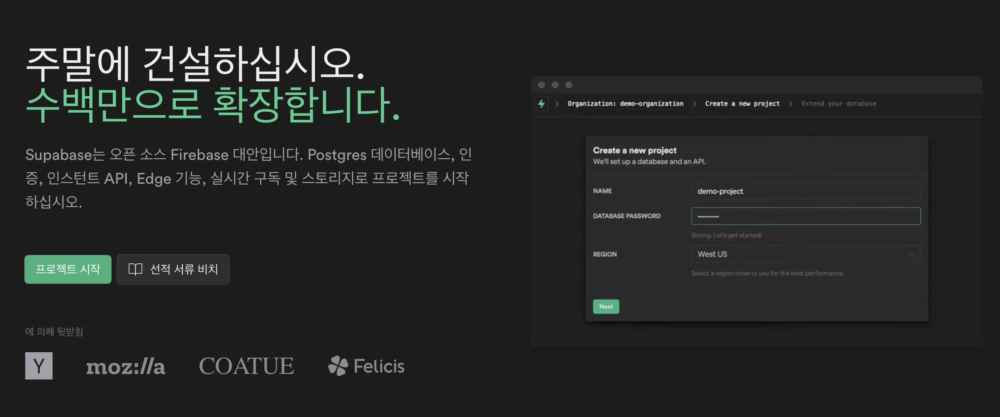
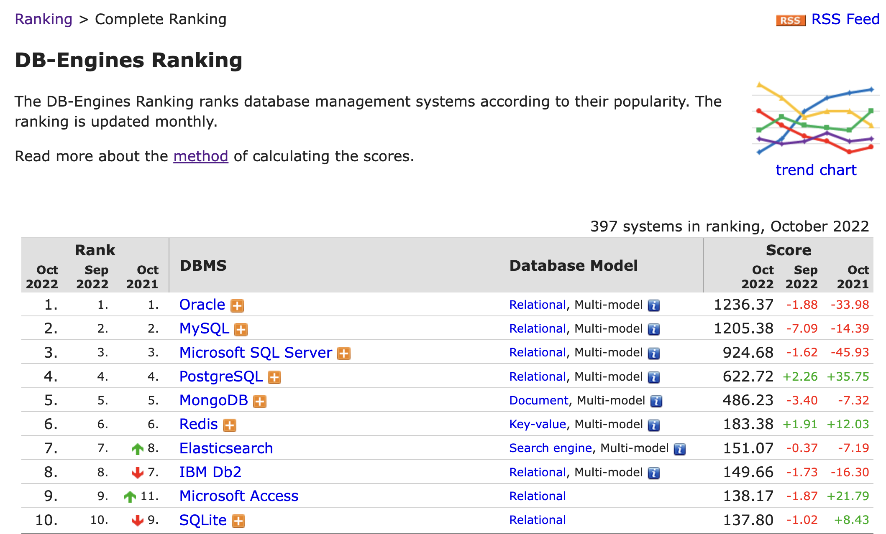
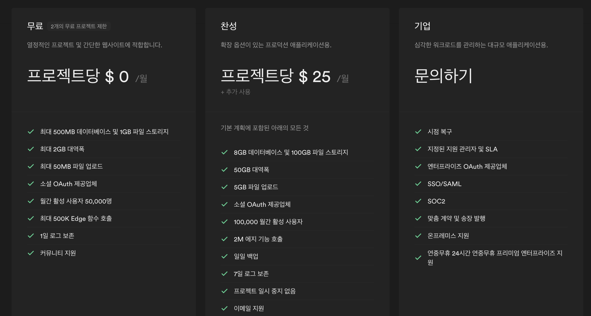

Supabase는 Firebase를 대체하기 위한 오픈 소스로 시작했습니다. 가장 큰 차이점은 Firebase의 데이터베이스인 Firestore나 Realtime Database는 noSQL을 지원하는 반면에, Supabase의 데이터베이스는 **관계형DB를 지원**한다는 점입니다.

### 결론

먼저 Supabase를 사이드 프로젝트용으로 추천하는 이유는 이렇습니다.

- Firebase와 비슷한 기능을 제공하면서 관계형DB를 지원한다.
- 무료 플랜이 사이드 프로젝트를 런칭하기에 매우 충분하다.

## Firebase와 비슷하면서 관계형DB를 지원한다

Firebase가 관계형DB를 지원했다면 사실 Firebase를 썼을 지도 모릅니다. 구글이 밀어주는 서비스이니까요.

제 경험상, noSQL을 사용해서 서비스를 만들 일은 생각보다 많지 않았습니다. noSQL을 사용하는 경우는 방대한 데이터 처리가 필요하거나 데이터 간의 관계가 명확하지 않아도 될 때인데, 사이드 프로젝트가 방대한 데이터 처리를 할 일도 보통 없기 마련이고, 거의 전세계 대부분의 기업이 관계형DB를 선호하기 때문에 이왕 사이드 프로젝트를 할거라면 공부도 할 겸 관계형DB를 택하는 것이 낫습니다.

## 무료 플랜이 사이드 프로젝트를 런칭하기에 매우 충분하다

2개의 프로젝트, 500MB의 데이터베이스 용량, 1GB의 저장소, 무제한 유저의 50,000명의 MAU까지 무료 지원인데, 이 정도면 제 기준에서는 웬만한 사이드 프로젝트는 전부 커버하고도 남는다고 봅니다. 애초에 저 기준을 넘는 사이드 프로젝트를 만든다면 그건 그 프로젝트가 성공했다고 봐도 무방하지 않을까요? ㅎㅎ

---

다만 Supabase에 대해 알아두셔야 할 사항들이 있긴 합니다. 누군가에게 단점이고 우려가 될 수도 있습니다.

### PostgreSQL과 SQL에 대한 이해

단순히 프론트엔드 개발자로만 커리어를 쌓았다면 이 서비스를 입문하기 힘드실 수도 있습니다. Firebase와 비교하자면 Firebase는 noSQL이다보니 DB 구성에 큰 애로사항이 없는 반면에, Supabase는 DB를 구성하는 데에 있어 **SQL의 기본적인 이해**가 반드시 필요합니다. GUI를 제공하기는 하지만 GUI도 SQL을 알지 못하면 어떻게 사용하는 지 알기 힘듭니다. 또한 PostgreSQL만의 문법 이해가 필요할 때도 있고, **Row Level Security**(RLS)라는 개념도 알아 두셔야 합니다.

### 영어

서울 리전은 제공하지만, 한글 페이지를 지원하지는 않습니다. 막 어려운 용어가 많은 건 아니지만 문서를 볼 때 번역을 많이 하셔야 할 겁니다.

## 정리

저 역시 많은 사이드 프로젝트들을 시작할 때 Supabase를 사용합니다. 이번에 만든 [피드뱅크](https://feedbank.app) 역시 Supabase를 사용해서 약 한 달간 혼자 만든 서비스입니다. 여러분들의 아이디어를 쉽게 구현해 주는 데에 있어 Supabase가 큰 역할을 해줄 수 있을 거라고 기대합니다.
