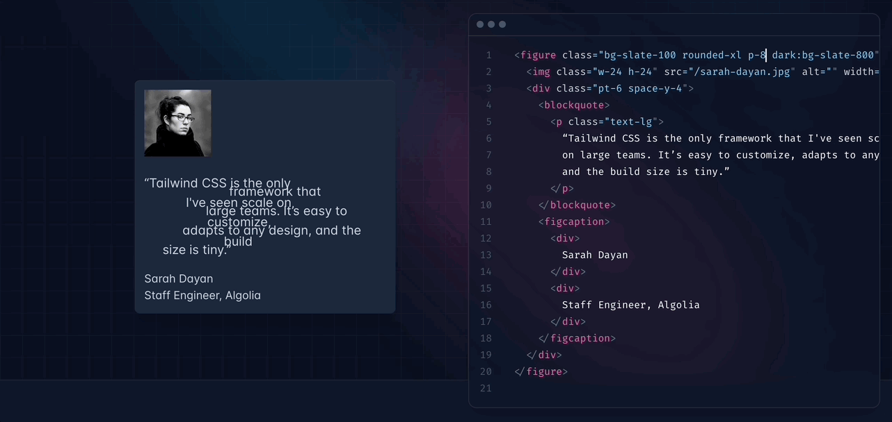
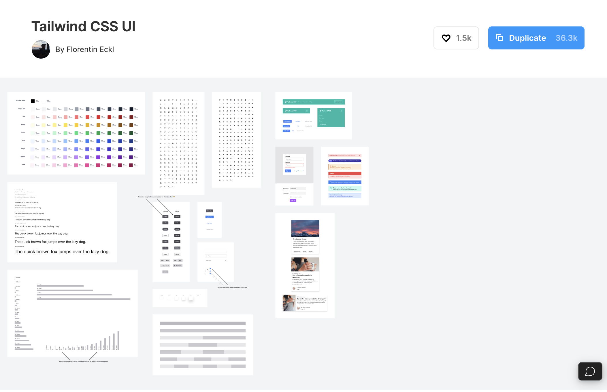
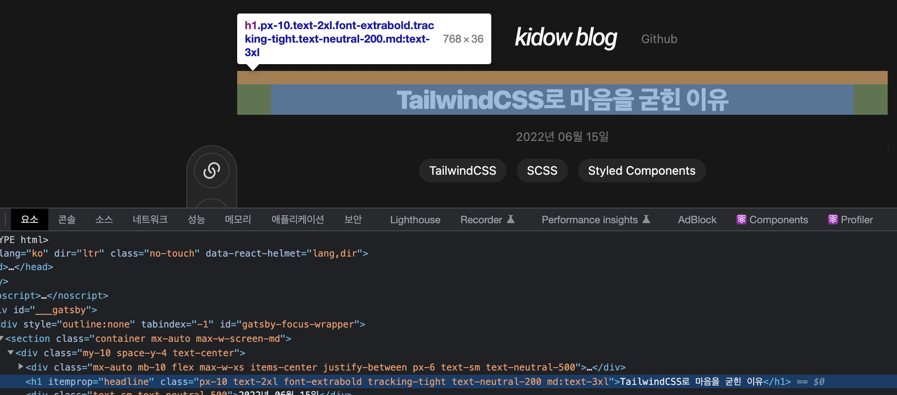

## styled components

프론트엔드에 처음 입문하고 React를 시작했을 때 처음 접했던 css 라이브러리가 `styled-components` 였습니다. 당시에는 **CSS-in-JS** 라고 해서 js 파일에서 css와 js를 한 번에 다룬다는 게 매력적이었었죠.


css이지만서도 props를 내려줄 수 있다는 것만큼은 스타일 컴포넌트가 상당히 매력적인 부분이라고 생각합니다. 하지만 스타일 컴포넌트를 사용하면서 특히나 불편했던 점을 예시로 토로해 보자면 이렇습니다.

```javascript
import React from 'react'
import styled from 'styled-components'

const Header = styled.header`
  padding: 1rem;
  border-bottom: 1px solid #e3e3e3;
  display: flex;
  align-items: center;
  justify-content: space-between;
  position: sticky;
  top: 0;
  background: #fff;
`

const Main = styled.main`
  min-height: 100vh;
  display: flex;
`

const Footer = styled.footer`
  height: 500px;
  border-top: 1px solid #e3e3e3;
  padding: 1rem;
`

const Container = styled.div``

const Aside = styled.aside`
  width: 200px;
  border-right: 1px solid #e3e3e3;
  padding: 1rem;
`

const Logo = styled.span`
  font-weight: bold;
`

const HeaderRight = styled.div``

const Wrapper = styled.div`
  padding: 1rem;
`

// 전체 코드의 절반 이상을 차지하는 styled components 코드들...

const Layout = () => {
  return (
    <Container>
      <Header>
        <Logo>Logo</Logo>
        <HeaderRight>로그인</HeaderRight>
      </Header>
      <Main>
        <Aside>Aside</Aside>
        <Wrapper>children</Wrapper>
      </Main>
      <Footer>Footer area</Footer>
    </Container>
  )
}

export default Layout
```

styled components가 **너무 많은 코드량을 잡아먹는다**라는 게 문제였습니다.

만약 저 코드에서 고쳐야 할 부분이 리액트 쪽 코드였다면, 번거롭게 파일에서 스크롤을 내리고 다녀야 합니다. 배치를 반대로 한다고 해도 거기서 거기인 셈이죠.

## scss

이런 식으로 코드 짜는 건 너무 이상하다 싶어 눈을 돌린 곳이 **SCSS** 였습니다. '그래, 차라리 파일을 분리해서라도 정석적인 게 좋을 때도 있지'라고 생각을 했죠.

그냥 CSS로 짜는거보다 훨씬 가독성 좋고, 코드량을 줄일 수 있어서 분명히 SCSS는 좋은 도구라고 저는 생각합니다.

하지만 styled components에서도 겪은 현상인데 scss 역시도 저에게는 정말 큰 불편함이 따르는 문제가 하나 있었습니다. 바로... **네이밍.**

## 콜백 헬보다 무서운 네이밍 헬


> 이름 짓는 거.. 해보시면 알지만 정말 소소하게 짜증나게 합니다.

이름을 잘 짓는 것이 중요하단 걸 알면서도, 이름을 떠올리는데 몇 초 혹은 심지어 몇 분까지 쓰게 되는 현상을 반복하면 뭘 한 것도 없는데 진이 빠지기 마련입니다. 개발 속도는... 말할 것도 없죠.

위에 styled components도 각각의 html 태그에 이름을 지정해야 하는데, scss로 바꾼다 해도 크게 달라질 게 사실 없습니다.

```css
.header {
  padding: 1rem;
  border-bottom: 1px solid #e3e3e3;
  display: flex;
  align-items: center;
  justify-content: space-between;
  position: sticky;
  top: 0;
  background: #fff;
}

.main {
  min-height: 100vh;
  display: flex;
}

.footer {
  height: 500px;
  border-top: 1px solid #e3e3e3;
  padding: 1rem;
}

.aside {
  width: 200px;
  border-right: 1px solid #e3e3e3;
  padding: 1rem;
}

.logo {
  font-weight: bold;
}

.wrapper {
  padding: 1rem;
}
```

이런 클래스들이 프로젝트에서 서로 이름이나 안 겹치면 다행인 수준입니다.

> 하지만! **TailwindCSS**는 놀랍게도 그 고질병을 고쳐주는 **기적**을 가져다 줄 수가 있습니다.

## 네이밍도 필요없이 디자인이 가능한 기술



TailwindCSS는 아무런 css 코드도 없이, HTML 태그의 class 속성에 자체 문법으로 문자열을 나열하는 것 만으로 알아서 스타일이 적용되는 효과를 경험할 수가 있습니다.
위의 사진을 보면 알겠지만 UI를 구성하는 과정에서 네이밍 작업은 하나도 없습니다. 그저 각각의 html tag들이 조금 길어졌다는 정도?

네이밍이 전혀 필요없는 이러한 장점이 **프론트엔드의 개발 속도를 폭발적으로 줄일 수 있는 이유가 된다고 생각합니다.**

### Figma와의 연동도 가능



Tailwind는 클래스명으로 작업이 가능한 덕분인지 [Figma Design Kit](https://www.figma.com/community/file/768809027799962739)를 자체적으로 가져다 쓸 수 있습니다. 위의 사진은 2년 전 업데이트가 마지막이라 예시이긴 하지만 Tailwind가 기본적으로 Color Palette나 Typography도 다 기본 설정이 되어 있기 때문에 디자이너 입장에서 이 부분에 대해 세팅하는 걸 걱정할 필요가 없습니다. 또한 디자이너가 스타일을 `.text-red-500`으로 주었다면, 개발자도 해당 부분에 `.text-red-500`으로 클래스를 지정하면 끝이기 때문에 소통에 드는 비용도 크게 줄이는 것이 가능합니다.

만약 styled components나 scss였다면? 일일히 컬러 팔레트... 타이포크래피... 일일이 찾아서 다 세팅해야 됩니다. 해봐서 알지만 그 작업도 진짜 시간아깝습니다.

### 설치 가이드도 간단


공식 문서도 제 기준에선 굉장히 깔끔하고 명시를 잘해놓은 것 같습니다. 설치 가이드 또한 요즘 쓰는 프레임워크는 다 가이드가 적혀 있기 때문에 깔라는 거 깔면 그냥 바로 시작할 수 있습니다.

### 자체적으로 제공하는 편리한 기능

디자이너들이 모여 만든 라이브러리라는 명성에 걸맞기 때문인지, 자체적으로 편리한 클래스명 컴포넌트들을 제공하기도 합니다. 대표적으로 animate의 경우, 해당 태그에 `.animate-bounce`라고만 적어도 바운스 애니메이션을 부여해주는 기능도 제공해주고 있습니다.

```css
// animate-bounce
animation: bounce 1s infinite;

@keyframes bounce {
  0%,
  100% {
    transform: translateY(-25%);
    animation-timing-function: cubic-bezier(0.8, 0, 1, 1);
  }
  50% {
    transform: translateY(0);
    animation-timing-function: cubic-bezier(0, 0, 0.2, 1);
  }
}
```


엄청나지 않나요? 위의 긴 코드가 단 한 줄로 완성됐습니다!

### 디버깅도 쉽다

의도치 않게 느끼게 된 건데, Tailwind로 짠 코드들은 각각의 html 태그가 클래스명이 천차만별이기 떄문에 의외로 문제가 생긴 코드를 찾는 게 엄청 빠릅니다. 개발자 도구에서 클래스명을 복사하고 에디터에서 검색을 하면, 해당 클래스명이 바로 검색이 되기 떄문이죠.




## 단점이 있다면

단점이라기보다는 아쉬운 점과 주의사항으로 나눠 생각해 볼 수 있을 것 같습니다.

### 아쉬운 점

TailwindCSS는 아직 **오피셜한 UI 라이브러리**가 없습니다. Tailwind UI가 있기는 하지만 유료이고, Material UI나 Ant Design처럼 UI Component들을 제공하는 공식 라이브러리는 아직 없습니다. 따라서, TailwindCSS로만 디자인을 할거라면, **컴포넌트들은 모두 직접 만들어야 합니다.**

간혹 TailwindCSS를 Material UI나 Ant Design과 같이 쓰는 분들도 있지만 저는 비효율적이라고 생각합니다. Tailwind와 타 UI 라이브러리의 글로벌 css가 충돌할 가능성이 크기 때문에 오히려 그것을 메꾸면서 시작하느라 코드가 이상해 질 수도 있습니다.

그래서 저는 TailwindCSS를 도입하고 난 뒤로는 Swiper같이 직접 구현하기 까다로운 컴포넌트 이외에는 Button이나 Input 같은 간단한 컴포넌트들은 모두 직접 만들어서 사용합니다. 그래서 [archive.](https://archive.kidow.me) 같은 프로젝트도 따로 만든 것이구요.

### 주의사항

**CSS의 기본 지식은 먼저 배우고 시작하는 걸 추천합니다.** 기본 지식 없이 Tailwind를 시작하는 것은 Javascript 지식도 없이 React를 시작하는 것과 같다고 봅니다. css의 `align-items: center;`가 TailwindCSS에서는 `.items-center`로 사용되는데, align-items가 뭔지 기본적으로라도 모르면 Tailwind 없이 CSS를 논할 때 아무것도 아는 게 없는 상황이 될 수도 있습니다.

## 마무리

TailwindCSS가 아무쪼록 현업에서 많이 쓰이길 바라며 글을 마무리하겠습니다. 감사합니다! 🙋‍♂️
