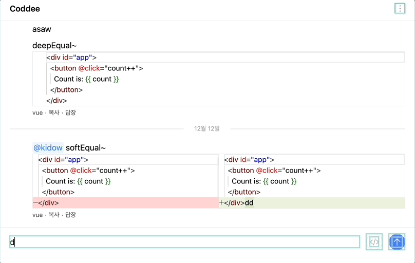
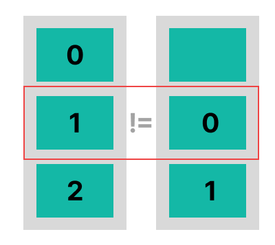
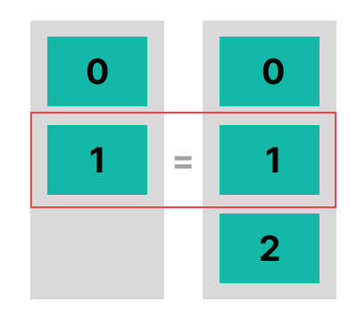
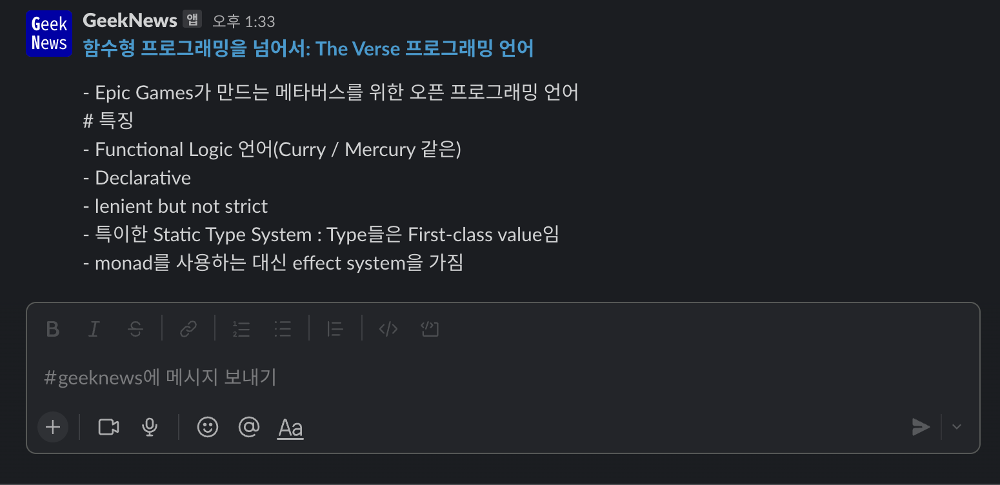
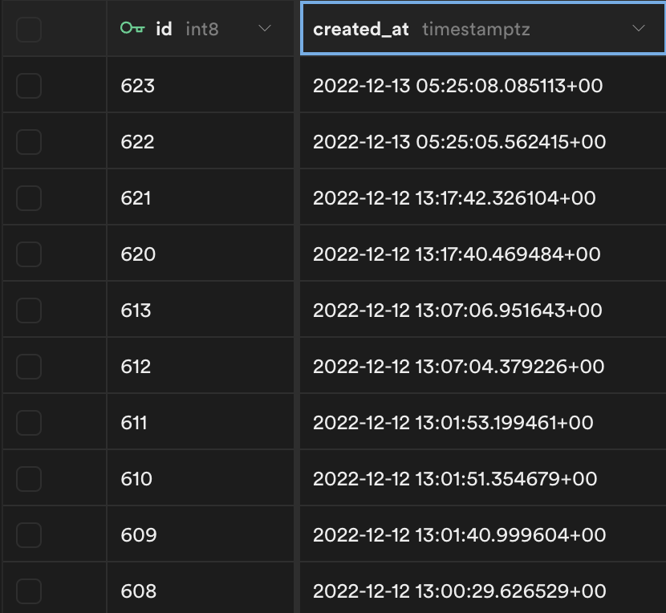
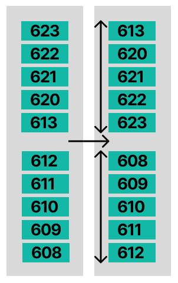

커디의 성능을 최적화하던 도중에 꽤 인상깊었던 경험이 있어서 공유해보고자 합니다.


### 개요

채팅방 UI를 꾸민다고 하면, 보통은 다음과 같은 특징들을 고려해야 합니다.

1. 가장 최신 채팅이 **최하단**에 와야 하며, 새 채팅이 등록되면 최하단에 추가해야 한다.
2. 이전 채팅을 불러오기 위한 무한 스크롤(Infinite scroll)은 일반적인 무한 스크롤과 달리 최하단이 아니라 **최상단**에서 일어나야 한다.
3. 데이터는 반드시 **최신순**으로 불러야 한다.

### 문제 상황

컴포넌트들을 열심히 memoization하던 와중에, 아무리 해도 memoize가 안되는 케이스가 하나 있었습니다. 바로 채팅 메시지 컴포넌트였는데요.

memoize를 했음에도 불구하고 새 채팅이 생성될 때마다 계속 re-rendering이 되면서 코드 에디터가 계속 다시 그려지는 문제가 생기고 있었습니다.



왜 그런가 하고 계속해서 로그를 찍으면서 원인 분석을 하던 도중에 문제를 발견했는데요.

새 채팅이 생성될 때, 다음처럼 새 데이터를 목록 맨 뒤가 아닌 맨 앞에 삽입해왔던 것이 문제였던 겁니다.

```typescript
// pages/room/[id].tsx
setList([
  {
    ...(새 데이터),
    reactions: [],
    saves: [],
    replies: [],
    opengraphs: [],
    user: { nickname: user.nickname, avatar_url: user.avatar_url }
  },
  ...list
])
```

이 상황에서 memoization이 될 수가 없는 게, 배열 맨 앞에 요소가 추가되면 나머지 요소들이 한 칸씩 밀리면서 각 위치에 있던 데이터가 전부 바꿔치기된다는 것이었습니다.

예를 들어, index가 1인 요소는 새로운 요소가 맨 앞에 추가될 시 요소 안의 데이터가 함께 이동하는 개념이 아니라,
index는 그 자리에 그대로 있고, 1에 있던 데이터만 2로 가버리고 0에 있던 데이터가 1로 이사오는 개념이 되버리면서,
memoization의 관점에서 보면 index = 1의 데이터는 1의 데이터에서 0의 데이터로 바뀌었기 때문에 memoize가 되는 것이 이론적으로 불가능했던 것이었습니다.



따라서 memoization을 해야 한다면 반드시 배열을 다음과 같이 새 요소가 추가될 때 반드시 배열 맨 뒤에 삽입해야 하는 구조로 짜야 한다는 것입니다.



### 실수

처음에 이렇게 의도했던 이유가 있었습니다. 개요에서 언급한 특징대로, 채팅 데이터 자체는 최신순으로 가져와야 하지만 채팅 목록에서 데이터를 보여줄 때는 **반대 순서로** 보여줘야 하기 때문입니다.

기존에는 이 방식을 **CSS의 관점**에서 해결했습니다. 다음처럼요.

```typescript
// flex-col-reverse
<main className="flex flex-1 flex-col-reverse py-3">
  {list.map((_, key) => (
    <Message.Chat key={key} chatIndex={key} />
  ))}
</main>
```

CSS로 해석하면 이렇습니다.

```css
main {
  display: flex;
  flex-direction: column-reverse;
}
```

css가 알아서 순서를 반대로 바꾸어주니까, 새 데이터만 배열 앞에 추가하면 되고, 이전 채팅을 무한 스크롤로 불러올 때는 그대로 배열 맨 뒤에 추가로 넣어주면 쉬운 문제였습니다.

물론 memoize는 될 수가 없죠. 때문에 이 방식을 전부 갈아엎어야 했습니다.

## 문제 해결

주로 참고해서 만들고 있는 슬랙을 들여다 봤습니다. 슬랙은 제가 생각했던 대로 데이터를 최신 순으로 불러오고 있었고, flex-direction 같은 건 적용하지 않고 있었습니다. 아마 불러온 목록의 순서를 뒤집었을 겁니다.




갈아 엎어야 할 로직들을 다음과 같이 나열했습니다.

- flex-col-reverse 삭제
- 최신순은 유지하되 불러온 목록의 순서를 뒤집기
- 추가된 채팅은 배열 맨 앞이 아닌 맨 뒤에 삽입
- 무한 스크롤로 불러온 채팅만큼은 배열 맨 앞에 삽입

### 순서 뒤집기

여기서 불러온 목록의 순서를 뒤집기 위해 `Array.prototype.reverse`를 사용했습니다. 처음 불러올 때부터 뒤집은 채로 불러오면 좋겠지만, 사용 중인 Supabase가 거기까지는 지원하지 않더라구요.

### 무한 스크롤

무한 스크롤의 경우, 데이터를 부르는 로직을 설명하기 위해 다음과 같이 예시를 들어봤습니다. 10개의 채팅을 5개씩 2번 부른다고 가정해봅시다.

여기 10개의 최신 데이터가 있습니다.



이 것을 다음과 같은 방식으로 구현해야 합니다.



최신 5개를 부르고 나서 `.reverse()`로 뒤집어서 배열에 넣고, 그 다음 5개를 부를 때도 **뒤집어서 배열 맨 뒤에** 넣는 것입니다.

## 결과

그렇게 갈아 엎고 난 뒤에 결과입니다.


반신반의했는데 기적처럼 제대로 작동하네요! 🎉
