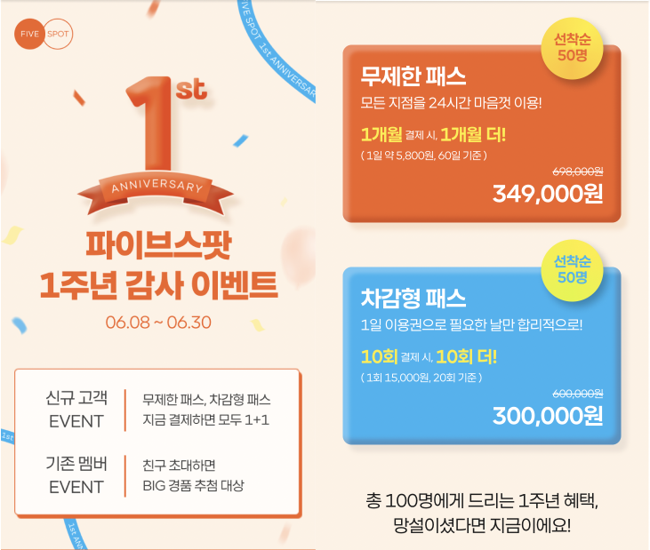
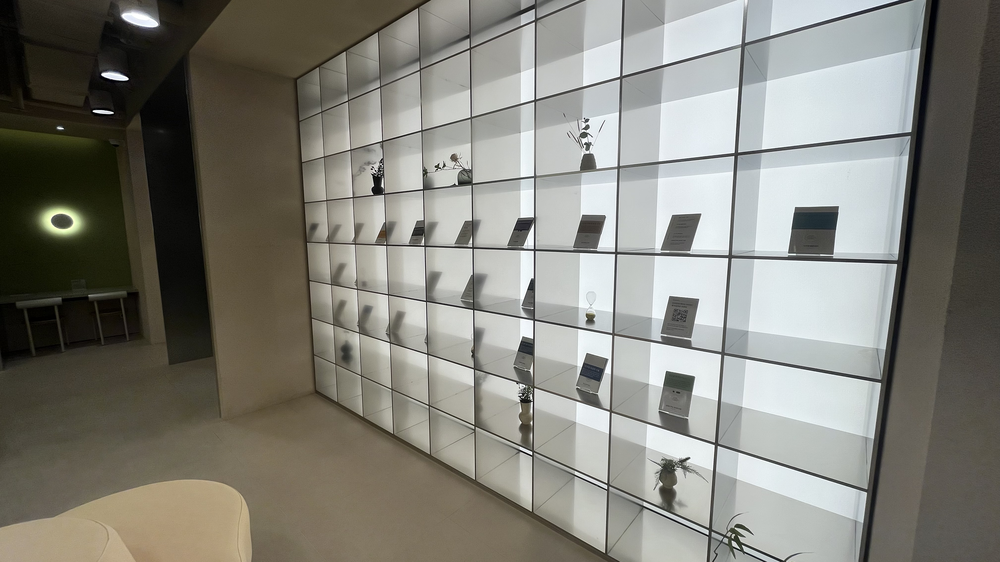

개인적으로 하고 싶은 사이드 프로젝트가 있어서 두 달 전부터 시작을 했는데요, 주말에 카페에 시간을 내서 가서 만들려고 하다 보면 자리가 없을 때는 헛걸음을 하게 되고, 안이 시끄러우면 집중도 안되기도 하고, 심지어 커피 하나만 시키고 몇 시간 있는 것도 눈치까지 보이니 카페에서 작업하는 것도 계속 할 짓이 못 되는 것 같더라구요.

아는 지인이 공유오피스에서 개인 업무를 보곤 했는데, 그 경험이 나쁘지는 않았다, 가격은 좀 되도 한 번쯤은 해볼만한 하다고 추천을 해서 관심이 좀 갔었습니다.

제가 처음으로 가본 공유오피스는 **파이브스팟**이었습니다. 처음에는 패스트파이브 내에 있는 남아 있는 공유 좌석들을 한 층만 따로 상품으로 만들어 새로 서비스를 만든 걸로 알고 있는데요, 일부 지점들을 보면 꼭 모든 곳이 그렇지는 않은 것 같고 아예 패스트파이브가 없는 빌딩에 파이브스팟이 있기도 하더라고요.

## 파이브스팟을 선택한 이유

다른 공유오피스들도 많았는데 당시 파이브스팟을 선택한 이유는 이것이었습니다.

패스트파이브야 원래 유명하니 퀄리티는 믿을만 할테지만, 직장인이다보니 주말밖에 시간을 낼 수 없는데 **차감형**이라는 옵션이 있더라구요. 처음에 10회의 30만 원은 좀 비싸다고 생각을 했는데 20회의 30만 원이라면 한번 정도는 해볼만 하지 않을까? 하는 생각이 들더라구요. 프로젝트를 시작하려는 그 시기에 딱 이런 1+1 이벤트를 하니까 저로서는 너무 매력적인 조건이었습니다. ㅎㅎ

## 후기를 쓰게 된 계기

2022년 8월 기준으로 파이브스팟의 총 지점 수는 모두 서울로 **16곳**이었어요. 나는 총 20번을 갈 수 있으니까..? 서울에 사는 겸 모든 지점을 한 번씩 다녀보고 후기랑 내부 사진을 남기면 좀 도움이 되지 않을까? 하는 생각을 하게 되서 이 글을 쓰게 되었습니다. 파이브스팟에 관심이 있는 분들한테 작은 참고가 되었으면 좋겠습니다. 거두절미하고 바로 본론으로 들어가죠. 😤

## 사전 정보

- 기본적으로 모든 지점이 폰부스, 커피머신, 프린터는 다 있습니다. 택배 접수, 미팅룸, 무인자판기, 탄산수 등은 없는 지점도 있습니다.
- 차감형 패스의 경우 파이브스팟 홈 > 쿠폰함 > 이용권에 들어가면 몇 회가 남았는지 알 수 있습니다.
- 시리얼은 있는 지점도 있고 없는 지점도 있어서 그냥 언급합니다. ~~(제가 시리얼을 좋아해서요)~~
- 화장실은 당연히 남자 화장실 기준입니다.
- 본래 의도인지는 모르겠으나, 꼭 파이브스팟으로 지정된 층만 사용 가능하진 않습니다. 메인 라운지에 있는 좌석이어도 신경쓰지 않는 것 같습니다.

### 삼성점

가장 처음으로 간 지점입니다. 처음으로 간 곳이라서 그런지 처음엔 인테리어도 깔끔하고 괜찮다고 생각했었는데, 나중 가보니 좌석이 거의 없다시피 한 평범 이하의 작은 지점이었습니다. 별로 넓지도 않고 업무용 좌석이 딱 10개?였던 것 같아요.

파이브스팟 층은 딱히 리뷰할 게 없는데, 오히려 메인 라운지(2층)가 생각보다 넓고 업무 가능한 좌석이 많아서 의아했습니다. 꼭 파이브스팟에서만 업무가 가능한 게 아니긴 하지만 파이브스팟만 놓고 얘기를 해야 겠죠?

- 6층
- 좌석이 다른 지점에 비해 굉장히 적은 편. **아마 가장 적지 싶다.**
- 시리얼 있음.
- 화장실은 6층이라서 창문뷰는 좋은데, 변기칸이... 좁다. 안에서 문 열때 몸비집고 나가야 한다. 왜 이렇게 만든거지?
- 주변에 점심을 해결할 식당이 생각보다 많지 않은 것 같았다.
- ★★☆☆☆

### 선릉점

선릉점은 개인적으로 정말 만족도가 낮은 지점 중 하나가 아닐까 싶습니다.

사실 선릉점은 작업을 파이브스팟 층에서 안하고 메인라운지에서 했습니다. 메인라운지가 천장이 높아 탁 트이고 1층이라서 출입하기 편하더라구요.

- 지하 1층
- 창문이 없다. ~~(갠적으로 창문이 없는 층은 칙칙해서 싫어한다)~~
- 화장실도 출입증 찍고 출입해야한다. 번거롭다...
- 좌석이 죄다 **칸막이**로 되어 있다. 순간 내가 독서실을 끊었나? 싶었다.
- 벽 보고 업무하는 것도 개인적으로 답답해서 싫어하는 데 모든 좌석이 그렇게 되어 있다. 그 좌석이 심지어 많은 것도 아니다. 대략 10여 개 안팎이었다.
- ★☆☆☆☆

### 여의도점

- 7층
- 적당히 넓고, 업무 좌석과 쉴 만한 좌석도 충분했다. 딱 만족할 만한 마지노선?
- 한 쪽 벽에 통유리로 창을 낸 것도 탁 트여서 좋았다.
- 바로 옆이 IFC몰이라서 밥을 해결할 곳도 많다.
- ★★★★☆

### 용산점

모든 파이브스팟 중에 가장 고층에 위치한 지점입니다. 그 점을 잘 살려 바깥 쪽 벽을 통유리로 해놓은 것이 탁 트여서 정말 좋습니다.

- 23층
- 엄청 높은 곳에 있어서 그런지 **뷰가 정말 끝내 준다.**
- 꽤 넓고 좌석도 많은 편이다. 좋기로 유명한 건지 사람들도 꽤 북적이는 곳이었다.
- 용산역이 바로 앞이고, 용산아이파크몰도 근처에 있기 때문에 밥 먹을 곳은 많다.
- 화장실도 정말 깨끗하고 여기는 화장실도 뷰가 좋다.
- ★★★★★

### 서초점

- 신기하게도 패스트파이브도 없이 딸랑 파이브스팟 1층만 있는 지점이다.
- 화장실이 유일하게 파이브스팟 관리 하에 있는 화장실이 아닌 것 같았다. 작고 좀 많이 더러웠다... 출입증을 찍고 왔다갔다 해야 하는 것도 번거로웠다.
- 별로 넓은 건 아니지만 우겨 넣을 건 최소한으로 우겨 넣은 느낌. 그래서 그런지 좌석 간 간격이 좀 좁은 편.
- 좌석은 적당히 있는 편이다.
- 시리얼과 전자렌지, 택배 접수 기계가 없다.
- 그래도 바깥 쪽 벽을 통유리로 해놓아서 햇살이 들어올 때 포근했다.
- 주변에 먹을 데가 없다.
- ★★★☆☆

### 영등포점

전체적으로 용산점과 유사한 점이 많습니다.

- 20층
- 용산과 마찬가지로 뷰가 아주 좋다. **뷰만큼은 가장 으뜸**이라고 본다.
- 타임스퀘어 옆이라서 근처 식당이 많다.
- 화장실도 아주 깨끗하고 뷰가 좋다. 다만 출입증 찍고 나가야 하는 건 조금 번거롭다.
- 신기하게도 지하 2층에 3500원짜리 구내식당이 있다. 먹어보진 않았는데 먹을 순 있는 것 같습니다.
- ★★★★★

### 구로점

- 12층
- 역시 고층이라서 뷰가 좋다.
- 굉장히 넓고 좌석은 **모든 지점 중 가장 많은 것 같다.** 한 40개 정도?
- 구로디지털단지라서 주변에 먹을 곳이 많다.
- 화장실도 넓고 깨끗하다.
- 주말에 갔는데도 사람들이 많이 오는 지점이었다.
- ★★★★★

### 서울숲점

- 2층
- **가장 넓은 지점이 아닐까 생각. 특히 천장이 높다.**
- 이 넓은 구역에 바깥 쪽 벽을 전부 통유리로 해놓았다. **탁 트이기로는 최고인 것 같다.**
- 상당히 넓어서 탁 트이고 좋은데 넓은 만큼 좌석을 배치하진 않은 느낌? 좌석 간 간격이 아주 넓은 편.
- 화장실이 밖에 있는 건 조금 불편했는데, 여기는 화장실도 인테리어가 독특했다.
- 2개의 공간으로 분리되어 있다. 처음에 작은 공간만 파이브스팟인 줄 알고 대실망할 뻔 했다.
- 밥 먹을 곳이 없지는 않은데 많지는 않다.
- 다른 지점과 다르게 프로모션을 자주 여는 곳 같았다.
- ★★★★★

### 서울역점

- 2층
- 서울역점도 꽤 넓고 좌석이 많은 편이다.
- 마치 호텔 느낌나는 세련된 인테리어와 다르게 화장실은 이상할 정도로 관리가 잘 안 되어 있다. 이쯤되면 금요일 저녁에 누가 일부러 망치고 간건가 싶다.
- 신기하게도 **리차징존**이라는 게 있다. 바디프렌드 의자를 구석진 곳에 넣어놓았는데, 주말에 사람이 없어서 원없이 체험해봤다. 엄청 시원했다.
- 유일하게 **샤워실**이 있다. 안내 데스크에 얘기하면 키를 준다고 해서 물어보니 실제로 이용 가능한 것 같다. 딱히 샤워할 일은 없어서 쓰진 않았다.
- 이곳도 화장실이 지점 밖에 있다.
- 안 좋은 방향으로 유일하게 에어컨이 없고 **냉풍기**라는 요상한게 있다. 성능은 에어컨에 못 미치는 편. 별로 안 시원하다. ~~(그래서 못 참고 다른 층 갔다)~~
- 서울역점이지만 서울역 옆에 있지는 않다. 그래서 근처에 밥집이 많은 건 아니었다.
- ★★★★☆ ~~(리차징존 가산점)~~

일부 지점은 플렌즈커피라는 무인커피기계 회사에 협업을 해서 무인커피기계를 배치해놨습니다. 패스트파이브를 이용하는 멤버는 할인가를 적용받습니다. 맛도 깔끔합니다.

### 반포점

- 1층
- 서초점과 마찬가지로 화장실이 밖에 있어서 파이브스팟 권한 밖이라 잘 관리가 안되있는 느낌이었고, 패스트파이브가 없이 파이브스팟만 있는 지점이다.
- 시리얼은 없는데 무인자판기는 있다.
- 미팅룸이 유독 많은 지점
- 유달리 **인테리어가 이쁘다고** 생각한 지점이었다. 색감이 다양하고 다른 지점과 다르게 그림도 걸어놔서 그런 것 같기도 하다.
- 음악을 틀어주는데 싫어하는 사람들을 위해 딥포커스존도 따로 만들어두었다.
- 넓고 좌석도 충분하다.
- ★★★☆☆

### 사당점

- 지하1층
- 지하지만 작은 창문이 나있어서 지하라는 느낌이 잘 안 드는 지점이었다.
- 꽤 넓고, 좌석도 예상보다 많았다.
- 흥미롭게도 서울역점처럼 **리차징존**이 있다. 다만 바디프렌드 의자가 있는 것은 아니고 발 마사지기가 있었다.
- 5층에 작은 루프탑이 있어서 나름 바람을 쐴 공간도 있다.
- ★★★★☆

### 합정점

- 지하1층
- 인테리어가 아주 이쁘다.
- 창문이 없는 게 약간의 흠
- 꽤 넓고 구로점 급으로 좌석도 많은 편
- 주변에 먹을 곳은 의외로 많지는 않더라.
- 화장실은 넓고 깨끗하다. 출입증 찍고 나가는 건 조금 불편.
- ★★★★☆

### 한남점

- 3층
- 인테리어가 이쁘다. 바깥쪽 벽이 통유리라서 쾌적하다.
- 화장실은 출입증 찍고 왔다갔다해야함. 다소 귀찮. 나름 깨끗했음.
- 무인자판기, 플렌즈커피, 탄산수 등 있을 건 다 있다.
- 적당히 넓고 좌석도 많다.
- 이태원이라 그런건지... 뭔 놈의 케밥집이 너무 많다. 물론 먹을 곳은 많다.
- ★★★☆☆

### 시청점

- 지하2층
- 지하임에도 불구하고 창이 나있고, 바깥과 연결되어 있어 답답한 느낌은 없었다.
- 시리얼이 없다.
- 좌석은 많은데 의외로 **콘센트가 있는 좌석이 별로 없다.**
- 바로 위 지하1층에 **먼슬리키친**라는 공용주방이 있었다. 식당이 10개 정도 다양하게 입점해 있어서 식사를 해결하기가 상당히 편했다.
- ★★★☆☆

### 역삼점

- 2층
- 막 넓지도 않고 좌석이 적지도 않고 그냥 쏘쏘한 지점이다.
- 화장실은 작다. 소변기, 대변기, 세면대 1개가 끝이다.
- 주변에 먹을 곳도 은근히 없다. 그리고 주변에 언덕이 좀 있다.
- **미팅룸이 유일하게 없다.** 혹시나 필요했던 사람이라면 꼭 체크하면 좋을 것 같다.
- ★★★☆☆

### 홍대점

- 지하1층, 1층, 5층으로 **총 세 층**이 파이브스팟이다.
- 각각의 층은 크기는 소소하지만 세 층이기 때문에 좌석 자체는 널널한 편이다.
- 화장실이 2개인데... 상당히 작고 좁다. 변기칸은 칸막이도 없어서 한 명씩 문 잠그고 써야 한다. 6층 전체가 쓰는 빌딩이 1인용 화장실이 겨우 2개? 괜찮은가?
- 홍대 한복판이라 그런지 **주변에 먹을 곳 천지다**
- 5층은 외부가 열려 있어 루프탑 느낌도 약간 낸 것 같다.
- 3층 통틀어 **폰부스가 딱 1개**뿐이다. 떄문에 폰부스 경쟁(?)이 치열해 보인다.
- ★★★☆☆

## 총평

어떤 지점은 굉장히 넓고 좌석도 많고 깔끔한 데 비해, 어떤 지점은 되게 작고 좌석도 적고 관리가 덜 되어 있는 게 보이는 등 지점 차가 좀 있는 것 같긴 합니다. 만족도가 좋았고 안 좋았던 지점과, 그리고 전체적인 총평을 내려볼까 합니다.

### 만족도가 높았던 지점

- 쾌적함 : 서울숲
- 뷰 : 영등포, 구로, 용산
- 시설 : 구로
- 주변 입지 : 용산, 구로, 영등포, 시청, 홍대
- 외적인 것 : 서울역~~(바디프렌드 가산점)~~
- 인테리어 : 반포, 합정, 한남
- 좌석 수 : 구로, 합정

### 만족도가 낮았던 지점

- 쾌적함 : 선릉
- 인테리어 : 선릉~~(독서실은 선넘지)~~
- 뷰 : 선릉
- 시설 : 서울역 ~~(냉풍기는 좀)~~
- 좌석 수 : 삼성 ~~(파이브스팟 한정)~~

### 전체적으로 좋았던 점

- 전체적으로 내부 시설들은 모든 지점이 다 깨끗했습니다.
- 인테리어는 어떤 지점이건 신경을 많이 쓴 흔적이 보입니다. 전체적으로 바닐라(?)색깔의 톤으로 꾸며 놨는데 신기하게도 파이브스팟에서는 하루종일 작업을 해도 눈이 피로하지 않더라구요.

### 전체적으로 아쉬웠던 점

- 일부 지점의 화장실은 잘 관리되고 있다는 느낌이 안들었습니다. 과거 회사에서 다녔던 위워크는 화장실이 정말 깨끗했었는데 좀 아쉽더라구요. 주말이라 그런 것이라고 생각하고 싶네요.
- 대략 절반 정도의 지점이 벽면이 굉장히 까칠까칠한 재질로 되어 있습니다. 실수로 피부가 닿으면 바로 까질 것처럼 불안해 보이더라구요. 벽면이 무슨 상관이냐고 물어볼 수도 있지만, 저도 처음에는 알고 싶지 않았습니다.. 😅
- 지점마다 다른 거 같은데 음악을 틀어 주는 데가 있고 안 틀어주는 데가 있습니다. 처음엔 안 틀어주는 건 줄 알았는데 그냥 있는 지점 없는 지점이 정해져 있는 것 같습니다. 음악이 있는 게 처음엔 중요한가 싶었는데, 음악이 없이 아주 조용한 지점들은 막상 겪어보면 상당히 허전한 특유의 느낌(?)이 있어요. 모든 지점에 음악을 틀어주면 하는 작은 바램이 있네요.
- 서초점에 갔을 때 뜬금없이 모바일 출입증이 작동을 안해서 땡볕에서 고생한 적이 있었습니다... 다행히 주말에도 긴급 문의가 있어서 몇 시간 뒤에 해결하긴 했는데 시스템 오류로 인해 날린 시간은 좀 아쉬웠었습니다.
- 일부 지점들은 들어가는 데만 출입증만 3번을 찍고 들어가게 되있었습니다. 모바일로 출입할 때는 진짜 귀찮습니다. 이렇게까지 번거롭게 설계할 일이 있는 건지 싶긴 합니다. ~~(특히 톨게이트같이 생긴 그거가 좀...)~~
- 일부 지점은 에어컨을 제어하는 곳이 어디인지 알 수가 없어서 더울 때 키고 추울 때 끄는 게 안되서 당황스러울 때가 간혹 있었습니다.

## 마무리

20회라서 30만 원임에도 불구하고 알차게 썼다고 생각합니다. 하지만 내가 돈을 잘 벌고 있는 게 아니라면 한 번쯤은 써볼만 한 정도?라고 생각이 듭니다. 물론 저는 만족했습니다. 돈만 부담없다면 얼마든지 만족할 만한 서비스라고 생각됩니다. 파이브스팟이 좋은 서비스로 거듭나길 바랍니다. 😄
